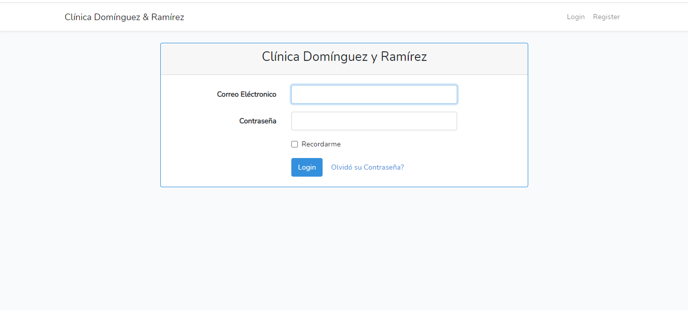
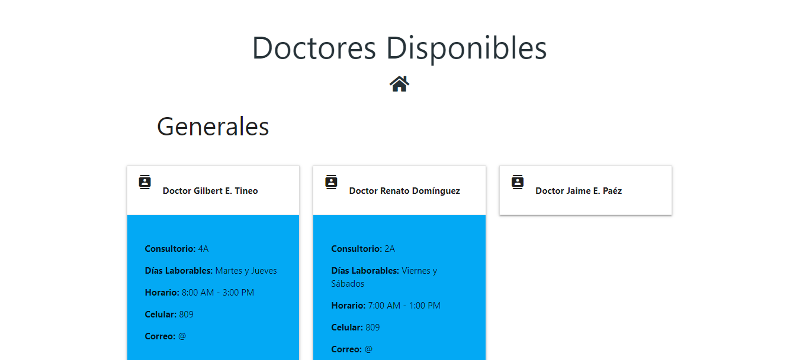

# Sistema de Registro Clínicos e Inserción de Medicamentos / System of Clinical Registration and Insertion of Medications

Este proyecto consiste en una página web la cual contiene un mini sistema para poder insertar información de un producto x que se haya comprado para el uso interno de la clínica y de la misma forma llevar un control básico simulando un inventario, la página tambien cuenta con un apartado para poder hacer los registros de los pacientes que van por primera vez a la clínica, tomando sus datos personales y alguna que otra infromación médica. Cada información es procesada y almacenada en la nube a traves de Firebase Real Time DataBase.

This project consists of a web page which contains a mini system to be able to insert information on a product x that has been purchased for the internal use of the clinic and in the same way carry out a basic control simulating an inventory, the page also has a section to be able to make the records of the patients who go to the clinic for the first time, taking their personal data and some other medical information. Each information is processed and stored in the cloud through Firebase Real Time DataBase.

## Herramientas Utilizadas / Used Tools

- Laravel :zap:
- BootsTrap :art:
- Materialize :art:
- FireBase :fire:

